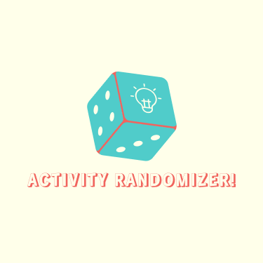

### Hello 👋🏻

Thank you for checking this project 🤠

It is a very simple application that displays random strings of suggestions for couples who are having trouble deciding the activity they can do together 😊
I used HTML, CSS and JavaScript for this application.

It was a useful JavaScript exercise where I practiced working with arrays and calling a function that retrieves a random string from a predefined list.

### Screenshot

Here is the [live preview](https://activity-r4ndomizer.netlify.app)
